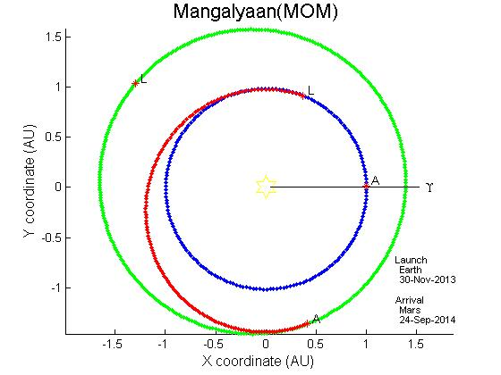

# Lambert_problem_matlab
MATLAB code for Interplanetary trajectory design by solving Classical Lambert problem and twi body problem.

**Some Resutls**

# Earth Parking orbit to Mars trajecotry design

|
